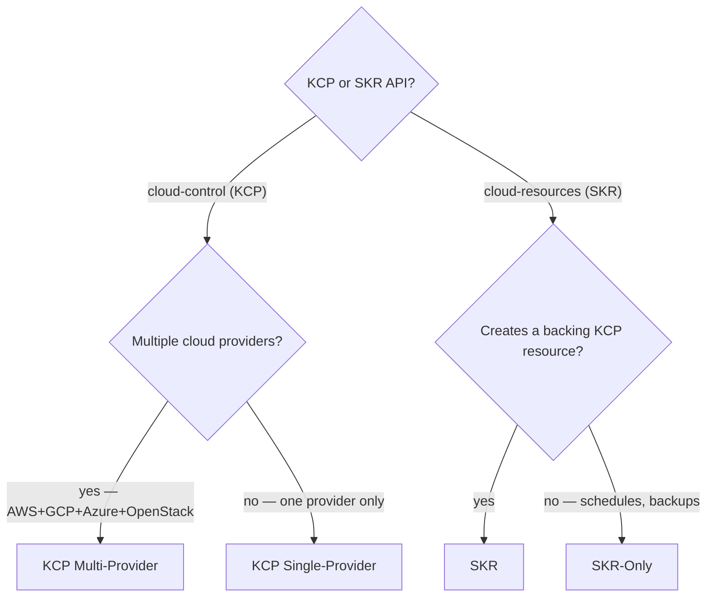

# Creating Reconcilers

Cloud Manager has three reconciler types. Read the correct reference BEFORE writing any code.
Announce which type you are implementing in your first response.

## Reconciler Type Decision

Use this flowchart when the type is not obvious, then confirm against the table:



| Scenario | Type | Reference |
|---|---|---|
| KCP resource reconciled across multiple providers (AWS/GCP/Azure/OpenStack) | KCP Multi-Provider | `references/kcp-multi-provider.md` |
| KCP resource for one specific provider only (e.g. GcpSubnet) | KCP Single-Provider | `references/kcp-single-provider.md` |
| SKR resource that creates and manages a corresponding KCP resource | SKR | `references/skr-reconciler.md` |
| SKR resource with no backing KCP resource (schedules, backups) | SKR-Only | `references/skr-only-pattern.md` |

> **Modifying existing legacy code** — If the shared `pkg/kcp/{resource}/reconciler.go` holds a `focalStateFactory focal.StateFactory` (not `kcpCommonStateFactory kcpcommonaction.StateFactory`), you are editing a legacy resource (`NfsInstance`, `RedisInstance`, `IpRange`). **Go with the flow**: read the existing implementation and continue its pattern exactly. Do not introduce `kcpcommonaction.State` structures unless explicitly asked to migrate. There is no separate legacy reference — the codebase is the reference.
>
> Note: `focal.State` also appears in the current single-provider pattern (`kcp-single-provider.md`), but only inside `pkg/kcp/provider/{provider}/{resource}/` — not in a shared `pkg/kcp/{resource}/` layer. That is NOT legacy.

> **Do NOT use this skill for:**
> - Writing tests for reconcilers → use `/testing-cloud-manager-code`
> - Migrating legacy `focal.State` resources to `kcpcommonaction.State` (requires explicit user approval)
> - Changing the type of an existing CRD field, or removing an existing CRD field (breaking changes — requires explicit user approval)
>
> **Adding new CRD fields** to support new reconciler functionality is in scope for this skill. After adding fields, run: `make manifests && ./config/patchAfterMakeManifests.sh && ./config/sync.sh`

## Architecture Overview

### KCP (cloud-control) — Control Plane

Runs in Kyma Control Plane. Reconciles cloud provider resources (VPC, NFS, Redis, etc.). Branches by provider (AWS, GCP, Azure, OpenStack) using a Switch predicate. Provider-specific StateFactory initializes cloud clients.

### SKR (cloud-resources) — Data Plane

Runs in each SAP BTP Kyma Runtime (user's cluster). No provider branching — linear pipelines. Syncs SKR spec to KCP objects, KCP status back to SKR. May also create local K8s resources (PV, PVC, Secrets). SKR-Only resources (schedules, backups) skip the backing KCP CRD and call KCP/cloud clients directly.

## Quick Reference

### Core Types (pkg/composed)

| Type | Signature | Purpose |
|------|-----------|---------|
| `Action` | `func(ctx context.Context, state State) (error, context.Context)` | Executable unit of work |
| `State` | Interface | Holds reconciliation context, K8s object, cluster access |
| `StateFactory` | `NewState(name, obj) State` | Creates State instances |
| `Predicate` | `func(ctx context.Context, state State) bool` | Conditional branching |

### Composition Functions

| Function | Usage |
|----------|-------|
| `ComposeActionsNoName(actions...)` | Sequential action pipeline (PREFERRED) |
| `ComposeActions(name, actions...)` | Named sequential pipeline (avoid) |
| `If(predicate, action)` | Execute action if predicate is true |
| `Switch(default, cases...)` | Multi-way branching |
| `NewCase(predicate, action)` | Case for Switch |

### Flow Control Errors

| Error | Behavior |
|-------|----------|
| `StopAndForget` | End reconciliation, no requeue |
| `StopWithRequeue` | End and requeue immediately |
| `StopWithRequeueDelay(d)` | End and requeue after duration |
| `Break` | Exit current composition |

### Built-in Predicates

- `MarkedForDeletionPredicate` — Object has deletion timestamp
- `NotMarkedForDeletionPredicate` — Object not marked for deletion (use this instead of `Not(MarkedForDeletionPredicate)`)

## Constraints

ALWAYS follow these rules. Deeper guidance on action signatures, file naming, error handling, logger usage, and interface compliance is in `references/conventions.md` — load it when creating a new reconciler package.

1. **Use `ComposeActionsNoName`** — avoid `ComposeActions` with names
2. **One action per line** when composing
3. **Separate delete and create/update** with comment markers:
   ```go
   // delete ================================================================================
   // create/update =========================================================================
   ```
4. **Use separate `If` blocks** instead of `IfElse`:
   ```go
   // CORRECT:
   composed.If(composed.MarkedForDeletionPredicate, deleteFlow),
   composed.If(composed.NotMarkedForDeletionPredicate, createUpdateFlow),

   // WRONG:
   composed.IfElse(composed.MarkedForDeletionPredicate, deleteFlow, createUpdateFlow)
   ```
5. **Use `NotMarkedForDeletionPredicate`** — not `Not(MarkedForDeletionPredicate)`
6. **Don't generate speculative actions** — use comment placeholders unless explicitly specified
7. **Sequential only** — actions execute one at a time. NEVER compose actions to run in parallel.
8. **Finalizer law** — every resource requiring deletion cleanup MUST have a finalizer. Add it on the create path. Remove it ONLY after deletion is fully confirmed (see pitfall #8).
9. **Injectable clock** — if a reconciler performs any time-based logic (scheduling, expiry, rate limiting), the StateFactory MUST accept `clock.Clock`. Use `clock.RealClock{}` in production and `clock.NewFakeClock()` in tests (see pitfall #11).

### Common Rationalizations — STOP

If you find yourself thinking any of the following, stop and re-read the rule:

| Rationalization | Reality |
|----------------|---------|
| "I'll add the finalizer after the create path works" | A finalizer added later creates an unprotected deletion window. Add it on the create path from the start (rule #8). |
| "It's a simple state assertion, a panic can't happen here" | Skipping a level in the state hierarchy always causes a runtime panic. Always assert through the full hierarchy (pitfall #1). |
| "Let me use `IfElse` — it's one line instead of two" | `IfElse` is explicitly forbidden (rule #4). Two separate `If` blocks are required. |
| "I'll parallelize these two independent actions for performance" | Sequential only. Actions NEVER run in parallel (rule #7). |

## Critical Pitfalls (Summary)

See `references/action-pitfalls.md`. Most frequent:
- **#1** state type assertion panic — ALWAYS assert through the full hierarchy, never skip levels
- **#2** missing `StopAndForget` at flow end — every successful path MUST terminate
- **#7** missing KCP labels when creating from SKR — breaks status sync and cross-cluster debugging
- **#13** adding `types/` subpackage to single-provider resources — only needed when multiple providers share a state interface

## References

**Read exactly ONE** (from the decision table above):
- `references/kcp-multi-provider.md` — KCP multi-provider pattern (AWS/GCP/Azure/OpenStack)
- `references/kcp-single-provider.md` — KCP single-provider pattern (GcpSubnet)
- `references/skr-reconciler.md` — SKR pattern (with backing KCP resource)
- `references/skr-only-pattern.md` — SKR-Only pattern (no KCP resource)

**Load these alongside your flow reference when the trigger applies:**

| Reference | Load when |
|-----------|-----------|
| `references/action-pitfalls.md` | Always — read this alongside every flow reference |
| `references/feature-flags.md` | Adding a new feature flag, or your primary type is SKR/SKR-Only |
| `references/status-mutation.md` | Writing any action that sets conditions or mutates `.Status` fields |
| `references/conventions.md` | Creating a new reconciler package (first file in a new directory) |
| `references/primitives.md` | Any question about composition, flow control, or util.Timing not answered by the Quick Reference above |
| `references/provider-clients.md` | Creating a new cloud provider client interface |

## Before Completing

Verify all of these before reporting done. Each item requires evidence — a specific code reference or command output, not a self-attestation:

1. **Every create path**: finalizer added (`AddCommonFinalizer` / `PatchAddCommonFinalizer`) before any cloud API call? *Evidence:* quote the file:line where the finalizer action is composed, and confirm it appears in the pipeline before the first cloud client call.
2. **Every SKR-created KCP object**: includes `LabelKymaName`, `LabelRemoteName`, `LabelRemoteNamespace`? *Evidence:* quote the `Labels:` map from the KCP object construction.
3. **Every success path**: ends with `StopAndForget` or `StopAndForgetAction`? *Evidence:* paste the tail of the composed pipeline showing the terminator.
4. **Every action return**: second return value is `ctx`, not `nil`? *Evidence:* `Grep` for `return .*, nil$` in your new files — must return zero matches.
5. **Compilation**: `make build` succeeds. *Evidence:* paste the final line of `make build` output.
