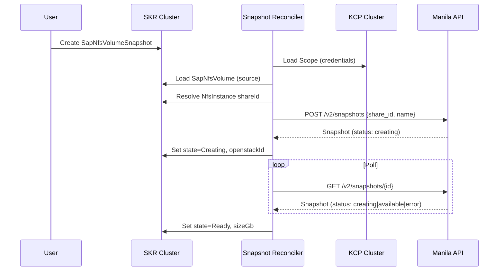
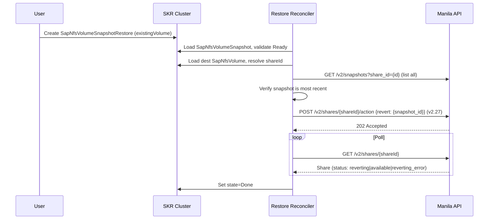
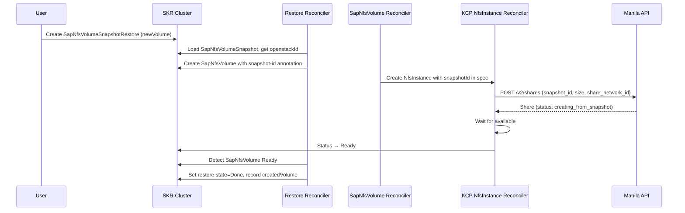

# Design Document: SAP NFS Volume Snapshot

## Overview

This document describes the design for snapshot support for SAP Converge Cloud (OpenStack) NFS volumes. The feature provides three new SKR-only CRDs — `SapNfsVolumeSnapshot`, `SapNfsVolumeSnapshotRestore`, and `SapNfsVolumeSnapshotSchedule` — that operate against the Manila Share Snapshots API on the target Antelope deployment (max microversion 2.78).

All three reconcilers follow the **SKR-only pattern** (no KCP component): they load the KCP `Scope` for OpenStack credentials and call Manila directly. This mirrors the architecture of `GcpNfsVolumeBackup/v2`.

### Key API Constraints (Antelope, v2.78)

| Capability | API | Microversion | Status | Docs |
|---|---|---|---|---|
| Create snapshot | `POST /v2/snapshots` | Base v2 | Stable | [Create share snapshot](https://docs.openstack.org/api-ref/shared-file-system/#create-share-snapshot) |
| List snapshots (detail) | `GET /v2/snapshots/detail` | Base v2 | Stable | [List share snapshots with details](https://docs.openstack.org/api-ref/shared-file-system/#list-share-snapshots-with-details) |
| Get/Delete snapshot | `GET/DELETE /v2/snapshots/{id}` | Base v2 | Stable | [Show share snapshot details](https://docs.openstack.org/api-ref/shared-file-system/#show-share-snapshot-details) / [Delete share snapshot](https://docs.openstack.org/api-ref/shared-file-system/#delete-share-snapshot) |
| Revert share to snapshot | `POST /v2/shares/{id}/action` | v2.27+ | Stable | [Revert share to snapshot](https://docs.openstack.org/api-ref/shared-file-system/#revert-share-to-snapshot-since-api-v2-27) |
| Create share from snapshot | `POST /v2/shares` (with `snapshot_id`) | Base v2 | Stable | [Create share](https://docs.openstack.org/api-ref/shared-file-system/#create-share) |
| Snapshot metadata | `GET/POST/PUT/DELETE /v2/snapshots/{id}/metadata` | v2.73+ | Stable | [Snapshot metadata](https://docs.openstack.org/api-ref/shared-file-system/#snapshot-metadata-since-api-v2-73) |
| Share backups | `POST /v2/share-backups` | v2.80+ | **Not available** | [Share backups (experimental)](https://docs.openstack.org/api-ref/shared-file-system/#share-backups-since-api-v2-80) |

### Gophercloud v2.11.1 Coverage

| Package | Functions Used | Source |
|---|---|---|
| [`openstack/sharedfilesystems/v2/snapshots`](https://pkg.go.dev/github.com/gophercloud/gophercloud/v2@v2.11.1/openstack/sharedfilesystems/v2/snapshots) | `Create`, `Get`, `Delete`, `ListDetail`, `ForceDelete` | [requests.go](https://github.com/gophercloud/gophercloud/blob/v2.11.1/openstack/sharedfilesystems/v2/snapshots/requests.go) |
| [`openstack/sharedfilesystems/v2/shares`](https://pkg.go.dev/github.com/gophercloud/gophercloud/v2@v2.11.1/openstack/sharedfilesystems/v2/shares) | `Revert` (requires microversion 2.27), `Create` (with `SnapshotID`) | [requests.go](https://github.com/gophercloud/gophercloud/blob/v2.11.1/openstack/sharedfilesystems/v2/shares/requests.go) |

Both packages are available in [gophercloud v2.11.1](https://pkg.go.dev/github.com/gophercloud/gophercloud/v2@v2.11.1) (already in `go.mod`). No new dependencies required.

---

## Data Models

### CRD: SapNfsVolumeSnapshot

**API Group:** `cloud-resources.kyma-project.io/v1beta1`  
**Location:** `api/cloud-resources/v1beta1/sapnfsvolumesnapshot_types.go`  
**Feature:** `FeatureNfsBackup`  
**Providers:** `["openstack"]`

```go
type SapNfsVolumeSnapshotSpec struct {
    // SourceVolume references the SapNfsVolume to snapshot.
    // +kubebuilder:validation:Required
    // +kubebuilder:validation:XValidation:rule=(self == oldSelf), message="SourceVolume is immutable."
    SourceVolume corev1.ObjectReference `json:"sourceVolume"`

    // DeleteAfterDays specifies the number of days after which the snapshot
    // will be automatically deleted. 0 means no automatic deletion.
    // +optional
    DeleteAfterDays int `json:"deleteAfterDays,omitempty"`
}

type SapNfsVolumeSnapshotStatus struct {
    // State of the snapshot lifecycle.
    // +optional
    State string `json:"state,omitempty"`

    // OpenstackId is the Manila snapshot UUID.
    // +optional
    OpenstackId string `json:"openstackId,omitempty"`

    // SizeGb is the snapshot size in GiB as reported by Manila.
    // +optional
    SizeGb int `json:"sizeGb,omitempty"`

    // ShareId is the Manila share UUID the snapshot belongs to.
    // +optional
    ShareId string `json:"shareId,omitempty"`

    // Conditions contain standard Kubernetes conditions.
    // +optional
    Conditions []metav1.Condition `json:"conditions,omitempty"`
}
```

**State values:** `Creating`, `Ready`, `Deleting`, `Error`, `Failed`

**Immutability:** `spec.sourceVolume` is immutable after creation (enforced via CEL validation).

### CRD: SapNfsVolumeSnapshotRestore

**API Group:** `cloud-resources.kyma-project.io/v1beta1`  
**Location:** `api/cloud-resources/v1beta1/sapnfsvolumesnapshotrestore_types.go`  
**Feature:** `FeatureNfsBackup`  
**Providers:** `["openstack"]`

```go
type SapNfsVolumeSnapshotRestoreSpec struct {
    // SourceSnapshot references the SapNfsVolumeSnapshot to restore from.
    // +kubebuilder:validation:Required
    // +kubebuilder:validation:XValidation:rule=(self == oldSelf), message="SourceSnapshot is immutable."
    SourceSnapshot corev1.ObjectReference `json:"sourceSnapshot"`

    // Destination specifies where to restore the snapshot data.
    // Exactly one of ExistingVolume or NewVolume must be set.
    // +kubebuilder:validation:Required
    // +kubebuilder:validation:XValidation:rule=(self == oldSelf), message="Destination is immutable."
    Destination SapNfsVolumeSnapshotRestoreDestination `json:"destination"`
}

// +kubebuilder:validation:MinProperties=1
// +kubebuilder:validation:MaxProperties=1
type SapNfsVolumeSnapshotRestoreDestination struct {
    // ExistingVolume references an existing SapNfsVolume to revert in-place.
    // The snapshot must be the most recent snapshot of this volume.
    // +optional
    ExistingVolume *corev1.ObjectReference `json:"existingVolume,omitempty"`

    // NewVolume defines a new SapNfsVolume to create from the snapshot.
    // +optional
    NewVolume *SapNfsVolumeSnapshotNewVolume `json:"newVolume,omitempty"`
}

type SapNfsVolumeSnapshotNewVolume struct {
    // Metadata for the new SapNfsVolume (name, labels, annotations).
    // name is required; namespace defaults to the restore's namespace.
    // +kubebuilder:validation:Required
    Metadata metav1.ObjectMeta `json:"metadata"`

    // Spec is the template for the new SapNfsVolume (same type as SapNfsVolumeSpec).
    // capacityGb must be >= the snapshot's source share size.
    // +kubebuilder:validation:Required
    Spec SapNfsVolumeSpec `json:"spec"`
}

type SapNfsVolumeSnapshotRestoreStatus struct {
    // State of the restore operation.
    // +optional
    State string `json:"state,omitempty"`

    // CreatedVolume references the SapNfsVolume created (new-volume restore only).
    // +optional
    CreatedVolume *corev1.ObjectReference `json:"createdVolume,omitempty"`

    // Conditions contain standard Kubernetes conditions.
    // +optional
    Conditions []metav1.Condition `json:"conditions,omitempty"`
}
```

**State values:** `InProgress`, `Done`, `Error`, `Failed`

**Immutability:** `spec.sourceSnapshot` and `spec.destination` are immutable after creation.

### CRD: SapNfsVolumeSnapshotSchedule

**API Group:** `cloud-resources.kyma-project.io/v1beta1`  
**Location:** `api/cloud-resources/v1beta1/sapnfsvolumesnapshotschedule_types.go`  
**Feature:** `FeatureNfsBackup`  
**Providers:** `["openstack"]`

```go
type SapNfsVolumeSnapshotScheduleSpec struct {
    // Schedule is a cron expression. If empty, creates a one-time snapshot.
    // +optional
    Schedule string `json:"schedule,omitempty"`

    // Prefix is used as a prefix for snapshot names.
    // +optional, defaults to schedule name.
    Prefix string `json:"prefix,omitempty"`

    // StartTime is the earliest time to start creating snapshots.
    // +optional
    StartTime *metav1.Time `json:"startTime,omitempty"`

    // EndTime is the latest time to stop creating snapshots.
    // +optional
    EndTime *metav1.Time `json:"endTime,omitempty"`

    // MaxRetentionDays is the maximum number of days to retain snapshots.
    // Stamped as deleteAfterDays on each created snapshot.
    // +optional
    MaxRetentionDays int `json:"maxRetentionDays,omitempty"`

    // MaxReadySnapshots is the maximum number of Ready snapshots to keep.
    // +kubebuilder:default=50
    // +optional
    MaxReadySnapshots int `json:"maxReadySnapshots,omitempty"`

    // MaxFailedSnapshots is the maximum number of Failed snapshots to keep.
    // +kubebuilder:default=5
    // +optional
    MaxFailedSnapshots int `json:"maxFailedSnapshots,omitempty"`

    // DeleteCascade determines whether snapshots are deleted with the schedule.
    // +kubebuilder:default=false
    // +optional
    DeleteCascade bool `json:"deleteCascade,omitempty"`

    // Suspend stops the schedule from creating new snapshots.
    // +optional
    Suspend bool `json:"suspend,omitempty"`

    // Template defines the SapNfsVolumeSnapshot to create on each run.
    // template.labels and template.annotations are stamped
    // onto created snapshots (schedule labels are always added).
    // template.spec.sourceVolume is required; template.spec.deleteAfterDays is
    // overridden by maxRetentionDays when set.
    // +kubebuilder:validation:Required
    Template SapNfsVolumeSnapshotTemplate `json:"template"`
}

type SapNfsVolumeSnapshotTemplate struct {
    // Labels to apply to created SapNfsVolumeSnapshot objects.
    // Merged with schedule-managed labels.
    // +optional
    Labels map[string]string `json:"labels,omitempty"`

    // Annotations to apply to created SapNfsVolumeSnapshot objects.
    // +optional
    Annotations map[string]string `json:"annotations,omitempty"`

    // Spec is the template for the SapNfsVolumeSnapshot spec.
    // +kubebuilder:validation:Required
    Spec SapNfsVolumeSnapshotSpec `json:"spec"`
}

type SapNfsVolumeSnapshotScheduleStatus struct {
    // State of the schedule.
    // +optional
    State string `json:"state,omitempty"`

    // LastCreateRun is the timestamp of the last snapshot creation.
    // +optional
    LastCreateRun *metav1.Time `json:"lastCreateRun,omitempty"`

    // LastDeleteRun is the timestamp of the last retention cleanup.
    // +optional
    LastDeleteRun *metav1.Time `json:"lastDeleteRun,omitempty"`

    // NextRunTimes lists the next scheduled run times.
    // +optional
    NextRunTimes []string `json:"nextRunTimes,omitempty"`

    // NextDeleteTimes maps snapshot names to their projected deletion times.
    // +optional
    NextDeleteTimes map[string]string `json:"nextDeleteTimes,omitempty"`

    // SnapshotIndex is the monotonically incrementing index for snapshot naming.
    // +optional
    SnapshotIndex int `json:"snapshotIndex,omitempty"`

    // Conditions contain standard Kubernetes conditions.
    // +optional
    Conditions []metav1.Condition `json:"conditions,omitempty"`
}
```

**State values:** `Active`, `Suspended`, `Done`, `Error`

---

## Interaction Diagrams

### Snapshot Create Flow



### In-Place Restore Flow



### New-Volume Restore Flow



---

## New Volume from Snapshot

For the new-volume restore path, the `SapNfsVolume` reconciler needs to propagate a snapshot ID when creating the Manila share. The mechanism:

1. **Annotation on SapNfsVolume:** `cloud-resources.kyma-project.io/snapshot-id: <manilaSnapshotId>`
2. **SKR reconciler reads annotation** in `kcpNfsInstanceCreate.go` and sets a new field on the `NfsInstance.Spec.Instance.OpenStack`
3. **KCP reconciler reads field** in `shareCreate.go` and passes it to `CreateShareOp()` as the `snapshotID` parameter
4. **Existing wiring:** `CreateShareOp()` already passes `snapshotID` to `shares.CreateOpts{SnapshotID: snapshotID}`

This requires:
- Adding `SnapshotID string` field to `NfsInstanceOpenStack` in `api/cloud-control/v1beta1/nfsinstance_types.go`
- Reading the annotation in the SKR `SapNfsVolume` reconciler and setting the field on KCP create
- Reading the field in the KCP `shareCreate.go` action

This is a minimal, additive change to existing CRDs (new optional field, no breaking change).

---

# Implementation Details

_Everything below this line is for the implementer. Reviewers can stop here._

---

## Architecture

### Reconciler Pattern

All three reconcilers use the **SKR-only pattern** matching `pkg/skr/gcpnfsvolumebackup/v2`:

```
User creates SKR resource (e.g. SapNfsVolumeSnapshot)
  → SKR reconciler loads Scope from KCP cluster
  → Reconciler creates OpenStack client with Scope credentials
  → Reconciler calls Manila API directly (no KCP CRD intermediary)
  → Status propagates back to SKR resource
```

### Action Composition Pattern

Per the requirement, all reconcilers use the **IfElse branching** for delete/non-delete flows:

```go
composed.IfElse(composed.Not(composed.MarkedForDeletionPredicate),
    composed.ComposeActions("create-path", ...),
    composed.ComposeActions("delete-path", ...),
)
```

### Action Naming Convention

Action names follow the SAP NFS instance naming convention (camelCase, resource-verb pattern):

| Pattern | Examples |
|---|---|
| `{resource}{Verb}` | `snapshotCreate`, `snapshotDelete`, `snapshotLoad` |
| `{resource}{WaitState}` | `snapshotWaitAvailable`, `snapshotWaitDeleted` |
| `{validation}` | `sourceVolumeLoad`, `sourceVolumeValidate` |
| `status{State}` | `statusReady`, `statusCreating`, `statusDeleting` |

### Feature Gating

All three reconcilers check the `nfsBackup` feature flag at startup:

```go
feature.LoadFeatureContextFromObj(&cloudresourcesv1beta1.SapNfsVolumeSnapshot{})
```

The feature flag check is inherited from the feature context loaded into the object. When `nfsBackup` is disabled, the reconciler short-circuits with `StopAndForget`.

---

## Components and Interfaces

### 1. OpenStack Snapshot Client

**Location:** `pkg/kcp/provider/sap/client/clientSnapshot.go`

Extends the existing SAP client composite with a new `SnapshotClient` interface. This follows the same pattern as the existing `ShareClient` in `pkg/kcp/provider/sap/client/clientShare.go`.

```go
type SnapshotClient interface {
    // Low-level operations matching gophercloud API
    CreateSnapshot(ctx context.Context, opts snapshots.CreateOpts) (*snapshots.Snapshot, error)
    GetSnapshot(ctx context.Context, snapshotId string) (*snapshots.Snapshot, error)
    DeleteSnapshot(ctx context.Context, snapshotId string) error
    ListSnapshots(ctx context.Context, opts snapshots.ListOpts) ([]snapshots.Snapshot, error)

    // Share revert (requires microversion 2.27)
    RevertShareToSnapshot(ctx context.Context, shareId string, snapshotId string) error

}
```

The `SnapshotClient` reuses the existing `shareSvc *gophercloud.ServiceClient` from the share client — both snapshot and share operations use the same Manila service endpoint. For the `RevertShareToSnapshot` call, the client sets `shareSvc.Microversion = "2.27"` before calling `shares.Revert()`.

**Integration:** The existing `Client` composite struct in `pkg/kcp/provider/sap/client/client.go` will embed `SnapshotClient` alongside the existing `ShareClient`, `NetworkClient`, `SubnetClient`, etc.

### Snapshot Name Uniqueness and ID Resolution

Manila does **not enforce uniqueness** on snapshot names ([Create share snapshot API](https://docs.openstack.org/api-ref/shared-file-system/#create-share-snapshot) — `name` is an optional free-text string, max 255 chars). Multiple snapshots of the same share can have identical names.

The [List share snapshots with details](https://docs.openstack.org/api-ref/shared-file-system/#list-share-snapshots-with-details) API supports filtering by `name` (query parameter, exact match) and `name~` (pattern match, since API v2.36). The gophercloud `snapshots.ListOpts` struct supports `Name string` and `ShareID string` filters ([source](https://github.com/gophercloud/gophercloud/blob/v2.11.1/openstack/sharedfilesystems/v2/snapshots/requests.go)).

**Snapshot creation and ID lifecycle:**

1. The reconciler generates a deterministic name and stores it in `status.id` (our internal identifier)
2. The snapshot is created in Manila using that name
3. After creation, Manila returns the snapshot UUID — we store it in `status.openstackId`
4. `status.openstackId` is the authoritative Manila identifier for all subsequent operations

**Edge case — transient failure saving openstackId:**

If the Manila snapshot is created successfully but we fail to persist `status.openstackId` (e.g., transient K8s API error), the next reconciliation will not have the openstackId. Without handling this, we would create a second snapshot with the same name (Manila allows duplicates).

**Resolution strategy in `snapshotLoad`:**

```
if status.openstackId is present:
    → fetch by ID: GetSnapshot(openstackId)
else:
    → fetch by name: ListSnapshots(ListOpts{Name: status.id, ShareID: shareId})
    → if found, persist openstackId to status (best effort)
    → if multiple results, pick the one matching our share_id
```

This means `snapshotLoad` has two code paths — by-ID (fast, normal case) and by-name (fallback for the edge case). The by-name path uses `ListSnapshots` filtered by both `Name` and `ShareID` for precision. After resolving, we immediately attempt to save `status.openstackId` so subsequent reconciliations use the fast path.

**Implication for `snapshotCreate`:**
- Before creating, `snapshotLoad` will have already checked whether a snapshot with our name exists (via the fallback path). If it does, we skip creation — idempotency is maintained.

### 2. SapNfsVolumeSnapshot Reconciler

**Location:** `pkg/skr/sapnfsvolumesnapshot/`

**Files:**
- `reconcile.go` — Action composition, `Reconciler` struct, `NewReconciler()`
- `state.go` — `State` struct, `StateFactory`, `NewStateFactory()`
- `loadScope.go` — Load `Scope` from KCP cluster for OpenStack credentials
- `clientCreate.go` — Create OpenStack client from Scope credentials
- `sourceVolumeLoad.go` — Load the referenced `SapNfsVolume`, validate Ready state
- `snapshotLoad.go` — Load existing Manila snapshot by `status.openstackId` (or by name as fallback)
- `snapshotCreate.go` — Create Manila snapshot via `snapshots.Create()`
- `snapshotWaitAvailable.go` — Poll until snapshot status is `available` or `error`
- `snapshotDelete.go` — Delete Manila snapshot
- `snapshotWaitDeleted.go` — Poll until snapshot is gone (404) or `error_deleting`
- `ttlExpiry.go` — Check if `deleteAfterDays` TTL has expired; trigger deletion
- `statusReady.go` — Set state to Ready, update snapshot size
- `statusCreating.go` — Set state to Creating
- `statusDeleting.go` — Set state to Deleting
- `shortCircuit.go` — Skip reconciliation if already Ready and no changes needed
- `markFailed.go` — Transition from Error to Failed for scheduled snapshots with newer successors

#### Client Initialization

SKR reconcilers do not have `focal.State` (no KCP scope hierarchy), so the Scope must be loaded as an explicit action. After `loadScope`, `clientCreate` uses the Scope credentials to construct the OpenStack client via `sapclient.SapClientProvider[sapclient.Client]`.

The client type used is the shared `sapclient.Client` from `pkg/kcp/provider/sap/client/` — there are no local client packages in the SKR reconciler directories. The `SnapshotClient` interface (added in `clientSnapshot.go`) is embedded into the existing composite `Client` alongside `ShareClient`, `NetworkClient`, etc.

```go
// clientCreate.go
func clientCreate(ctx context.Context, st composed.State) (error, context.Context) {
    state := st.(*State)
    pp := sapclient.NewProviderParamsFromConfig(sapconfig.SapConfig).
        WithDomain(state.Scope.Spec.Scope.OpenStack.DomainName).
        WithProject(state.Scope.Spec.Scope.OpenStack.TenantName).
        WithRegion(state.Scope.Spec.Region)
    sapClient, err := state.provider(ctx, pp)
    if err != nil {
        return fmt.Errorf("error creating sap client for snapshot: %w", err), nil
    }
    state.sapClient = sapClient
    return nil, ctx
}
```

**Action Composition:**

```
sapNfsVolumeSnapshotMain:
  feature.LoadFeatureContextFromObj
  composed.LoadObj
  sapNfsVolumeSnapshot:
    loadScope
    clientCreate
    shortCircuitCompleted
    markFailed
    actions.AddCommonFinalizer()
    snapshotLoad
    sourceVolumeLoad
    ttlExpiry
    IfElse(!MarkedForDeletion):
      CREATE path:
        snapshotCreate
        snapshotWaitAvailable
        statusReady
      DELETE path:
        snapshotDelete
        snapshotWaitDeleted
        actions.RemoveCommonFinalizer()
    composed.StopAndForgetAction
```

**State Structure:**

```go
type State struct {
    composed.State
    KymaRef    klog.ObjectRef
    KcpCluster composed.StateCluster
    SkrCluster composed.StateCluster

    Scope         *cloudcontrolv1beta1.Scope
    SapNfsVolume  *cloudresourcesv1beta1.SapNfsVolume  // source volume
    snapshot      *snapshots.Snapshot                   // gophercloud snapshot
    sapClient     sapclient.Client                      // from pkg/kcp/provider/sap/client
    provider      sapclient.SapClientProvider[sapclient.Client]
}
```

### 3. SapNfsVolumeSnapshotRestore Reconciler

**Location:** `pkg/skr/sapnfsvolumesnapshotrestore/`

Uses the same `loadScope` → `clientCreate` pattern as the snapshot reconciler. Client type is `sapclient.Client` from `pkg/kcp/provider/sap/client/`.

**Files:**
- `reconcile.go` — Action composition
- `state.go` — State struct + StateFactory
- `loadScope.go` — Load Scope from KCP cluster
- `clientCreate.go` — Create OpenStack client from Scope
- `sourceSnapshotLoad.go` — Load the referenced `SapNfsVolumeSnapshot`, validate Ready
- `destinationVolumeLoad.go` — Load the destination `SapNfsVolume` (for in-place)
- `restoreInPlace.go` — Execute `RevertShareToSnapshot()` for in-place revert
- `restoreInPlaceWait.go` — Poll share status until `available` (done reverting) or `reverting_error`
- `restoreNewVolume.go` — Create a new `SapNfsVolume` CR with snapshot ID annotation
- `restoreNewVolumeWait.go` — Wait for the new `SapNfsVolume` to reach Ready
- `validateInPlace.go` — Validate in-place constraints (snapshot belongs to volume, is most recent)
- `statusDone.go` — Set state to Done
- `statusFailed.go` — Set state to Failed
- `statusInProgress.go` — Set state to InProgress

**Action Composition:**

```
sapNfsVolumeSnapshotRestoreMain:
  feature.LoadFeatureContextFromObj
  composed.LoadObj
  sapNfsVolumeSnapshotRestore:
    loadScope
    clientCreate
    actions.AddCommonFinalizer()
    sourceSnapshotLoad
    IfElse(!MarkedForDeletion):
      NON-DELETE path:
        IfElse(isInPlaceRestore):
          IN-PLACE path:
            destinationVolumeLoad
            validateInPlace
            restoreInPlace
            restoreInPlaceWait
            statusDone
          NEW-VOLUME path:
            restoreNewVolume
            restoreNewVolumeWait
            statusDone
      DELETE path:
        actions.RemoveCommonFinalizer()
    composed.StopAndForgetAction
```

**State Structure:**

```go
type State struct {
    composed.State
    KymaRef    klog.ObjectRef
    KcpCluster composed.StateCluster
    SkrCluster composed.StateCluster

    Scope                *cloudcontrolv1beta1.Scope
    SourceSnapshot       *cloudresourcesv1beta1.SapNfsVolumeSnapshot
    DestinationVolume    *cloudresourcesv1beta1.SapNfsVolume    // for in-place
    CreatedVolume        *cloudresourcesv1beta1.SapNfsVolume    // for new-resource
    sapClient            sapclient.Client                       // from pkg/kcp/provider/sap/client
    provider             sapclient.SapClientProvider[sapclient.Client]
}
```

#### In-Place Revert Flow

1. Validate that the snapshot's `spec.sourceVolume` matches the destination volume
2. Resolve the `SapNfsVolume` → KCP `NfsInstance` → `status.stateData["shareId"]` to get the Manila share ID
3. Resolve the `SapNfsVolumeSnapshot` → `status.openstackId` to get the Manila snapshot ID
4. List all snapshots for the share, verify the target snapshot is the most recent (newest `created_at`)
5. Call `shares.Revert(ctx, client, shareId, shares.RevertOpts{SnapshotID: snapshotId})` with microversion 2.27
6. Poll share status: `reverting` → `available` (success) or `reverting_error` (failure)
7. Set restore state to `Done` or `Failed`

#### New-Volume Restore Flow

1. Create a new `SapNfsVolume` CR in the SKR cluster using the template from the restore spec
2. Set an annotation on the new `SapNfsVolume` that carries the Manila snapshot ID: `cloud-resources.kyma-project.io/snapshot-id: <openstackSnapshotId>`
3. The existing `SapNfsVolume` reconciler reads this annotation and passes `snapshotID` to `CreateShareOp()` — this is already wired in the existing client
4. Wait for the new `SapNfsVolume` to reach `Ready` state
5. Record the created volume reference in the restore's status
6. Set restore state to `Done`

**Note:** The `SapNfsVolume` reconciler's create path already passes `snapshotID` through `CreateShareOp()`. For the new-volume restore flow, we need a small addition to the `SapNfsVolume` SKR reconciler: read the snapshot-id annotation from `SapNfsVolume` and propagate it to the KCP `NfsInstance` spec. The KCP `NfsInstance` reconciler then uses it in `shareCreate.go` when calling `CreateShareOp()`. The existing `CreateShareOp()` already accepts `snapshotID string` as a parameter.

### 4. SapNfsVolumeSnapshotSchedule Reconciler

**Location:** `pkg/skr/sapnfssnapshotschedule/`

**Pattern:** Follows the `pkg/skr/gcpnfsbackupschedule/` pattern — **NOT** the `backupImpl` interface pattern.

The schedule reconciler composes shared scheduling actions from `pkg/skr/backupschedule/` alongside SAP-specific actions. It does **not** implement the `backupImpl` interface. This is the same lighter-weight approach used by `GcpNfsBackupSchedule` (v2).

**Reference implementation:** `pkg/skr/gcpnfsbackupschedule/`

**Files:**
- `reconcile.go` — Action composition, `Reconciler` struct, `NewReconciler()`
- `state.go` — `State` struct implementing `backupschedule.ScheduleState` interface
- `loadSnapshots.go` — Load existing `SapNfsVolumeSnapshot` CRs by schedule labels
- `loadScope.go` — Load `Scope` from KCP cluster
- `loadSource.go` — Load source `SapNfsVolume`, validate Ready
- `createSnapshot.go` — Create `SapNfsVolumeSnapshot` CR with schedule metadata
- `deleteSnapshots.go` — Delete excess snapshots per retention policy
- `deleteCascade.go` — Delete all snapshots when schedule deleted with `deleteCascade: true`
- `setStatusToActive.go` — Set schedule state to Active

**Action Composition (aligned with gcpnfsbackupschedule):**

```go
func (r *Reconciler) newAction() composed.Action {
    return composed.ComposeActions(
        "sapNfsSnapshotSchedule",
        feature.LoadFeatureContextFromObj(&cloudresourcesv1beta1.SapNfsVolumeSnapshotSchedule{}),
        composed.LoadObj,
        actions.AddCommonFinalizer(),
        loadSnapshots,
        composed.IfElse(
            composed.Not(composed.MarkedForDeletionPredicate),
            // Main (create) path
            composed.ComposeActions(
                "sapNfsSnapshotSchedule-main",
                // Common scheduling actions (from pkg/skr/backupschedule/)
                backupschedule.CheckCompleted,
                backupschedule.CheckSuspension,
                backupschedule.ValidateSchedule,
                backupschedule.ValidateTimes,
                backupschedule.CalculateOnetimeSchedule,
                backupschedule.CalculateRecurringSchedule,
                backupschedule.EvaluateNextRun,
                // SAP-specific actions
                loadScope,
                loadSource,
                createSnapshot,
                deleteSnapshots,
                setStatusToActive,
            ),
            // Delete path
            composed.ComposeActions(
                "sapNfsSnapshotSchedule-delete",
                deleteCascade,
                actions.RemoveCommonFinalizer(),
            ),
        ),
        composed.StopAndForgetAction,
    )
}
```

**State Structure (implements `backupschedule.ScheduleState`):**

```go
type State struct {
    composed.State
    KymaRef    klog.ObjectRef
    KcpCluster composed.StateCluster
    SkrCluster composed.StateCluster

    // Common scheduling (same fields as GcpNfsBackupSchedule state)
    Scheduler      *backupschedule.ScheduleCalculator
    cronExpression *cronexpr.Expression
    nextRunTime    time.Time
    createRunDone  bool
    deleteRunDone  bool

    // SAP-specific (concrete types, no interfaces)
    Scope     *cloudcontrolv1beta1.Scope
    Source    *cloudresourcesv1beta1.SapNfsVolume
    Snapshots []*cloudresourcesv1beta1.SapNfsVolumeSnapshot

    env abstractions.Environment
}

// Implements backupschedule.ScheduleState interface
func (s *State) ObjAsBackupSchedule() backupschedule.BackupSchedule { ... }
func (s *State) GetScheduleCalculator() *backupschedule.ScheduleCalculator { ... }
func (s *State) GetCronExpression() *cronexpr.Expression { ... }
func (s *State) SetCronExpression(e *cronexpr.Expression) { ... }
func (s *State) GetNextRunTime() time.Time { ... }
func (s *State) SetNextRunTime(t time.Time) { ... }
func (s *State) IsCreateRunCompleted() bool { ... }
func (s *State) SetCreateRunCompleted(v bool) { ... }
func (s *State) IsDeleteRunCompleted() bool { ... }
func (s *State) SetDeleteRunCompleted(v bool) { ... }
```

**`createSnapshot` action** creates `SapNfsVolumeSnapshot` CRs from the schedule's `template`:
- Name: `{prefix}-{index}-{timestamp}` (matching GCP pattern)
- Labels: schedule-managed labels (`cloud-resources.kyma-project.io/scheduleName`, `scheduleNamespace`) merged with `template.labels`
- Annotations: from `template.annotations`
- `spec`: copied from `template.spec`, with `deleteAfterDays` overridden by `maxRetentionDays` when set
- Before creating, checks if snapshot already exists by name (idempotency)

**Retention logic:**
- **Count-based:** `deleteSnapshots` action evicts oldest Ready snapshot when total exceeds `maxReadySnapshots`. Garbage-collects Failed snapshots beyond `maxFailedSnapshots`.
- **Time-based:** Each snapshot's `deleteAfterDays` is enforced by the snapshot reconciler's `ttlExpiry` action.

**Cascade deletion:** When the schedule is deleted with `deleteCascade: true`, `deleteCascade` action deletes all snapshots with matching schedule labels.

---

### 5. Existing Reconciler Changes for Snapshot-Based Volume Creation

The new-volume restore path requires modifications to the existing `SapNfsVolume` (SKR) and `NfsInstance` (KCP) reconcilers to propagate a snapshot ID through to Manila's `POST /v2/shares`.

#### 5a. KCP API: Add `SnapshotID` to `NfsInstanceOpenStack`

**File:** `api/cloud-control/v1beta1/nfsinstance_types.go`

The existing struct has only `SizeGb`. Add an optional `SnapshotID` field:

```go
type NfsInstanceOpenStack struct {
    // +kubebuilder:validation:Required
    SizeGb int `json:"sizeGb"`

    // SnapshotID is the Manila snapshot UUID to create the share from.
    // When set, Manila creates the share as a copy of this snapshot.
    // +optional
    SnapshotID string `json:"snapshotId,omitempty"`
}
```

This is an additive, non-breaking change — existing `NfsInstance` resources without `snapshotId` continue to work as before.

#### 5b. SKR: Read Annotation in `kcpNfsInstanceCreate.go`

**File:** `pkg/skr/sapnfsvolume/kcpNfsInstanceCreate.go`

Currently sets `NfsInstanceOpenStack{SizeGb: ...}` with no snapshot ID. Change to:

```go
snapshotID := state.ObjAsSapNfsVolume().GetAnnotations()[AnnotationSnapshotId]

Instance: cloudcontrolv1beta1.NfsInstanceInfo{
    OpenStack: &cloudcontrolv1beta1.NfsInstanceOpenStack{
        SizeGb:     state.ObjAsSapNfsVolume().Spec.CapacityGb,
        SnapshotID: snapshotID,
    },
},
```

The annotation is only present when the `SapNfsVolume` was created by the restore reconciler. For normal (non-snapshot) volumes, the annotation is absent and `SnapshotID` is `""`.

#### 5c. KCP: Pass `SnapshotID` in `shareCreate.go`

**File:** `pkg/kcp/provider/sap/nfsinstance/shareCreate.go`

Currently hardcodes `""` for the snapshot ID parameter:

```go
// Before:
share, err := state.sapClient.CreateShareOp(ctx, ..., "", metadata)

// After:
snapshotID := state.ObjAsNfsInstance().Spec.Instance.OpenStack.SnapshotID
share, err := state.sapClient.CreateShareOp(ctx, ..., snapshotID, metadata)
```

No changes needed to `CreateShareOp()` itself — it already accepts and forwards `snapshotID` to `shares.CreateOpts{SnapshotID: snapshotID}`.

#### 5d. Annotation Constant

Define in `api/cloud-resources/v1beta1/` (or a shared annotations file):

```go
const AnnotationSnapshotId = "cloud-resources.kyma-project.io/snapshot-id"
```

#### 5e. CRD Version Patching

**File:** `config/patchAfterMakeManifests.sh`

Add version annotations for all three new CRDs:

```bash
yq -i '.metadata.annotations."cloud-resources.kyma-project.io/version" = "v0.0.1"' $SCRIPT_DIR/crd/bases/cloud-resources.kyma-project.io_sapnfsvolumesnapshots.yaml
yq -i '.metadata.annotations."cloud-resources.kyma-project.io/version" = "v0.0.1"' $SCRIPT_DIR/crd/bases/cloud-resources.kyma-project.io_sapnfsvolumesnapshotrestores.yaml
yq -i '.metadata.annotations."cloud-resources.kyma-project.io/version" = "v0.0.1"' $SCRIPT_DIR/crd/bases/cloud-resources.kyma-project.io_sapnfsvolumesnapshotschedules.yaml
```

---

## Resolving Share ID from SapNfsVolume

The snapshot reconciler needs the Manila share ID to create a snapshot. The flow to resolve it:

1. Read `SapNfsVolume.Status.Id` (the UUID used as the KCP `NfsInstance` name)
2. Load the KCP `NfsInstance` by name from the KCP cluster
3. Read `NfsInstance.Status.StateData["shareId"]` — this is the Manila share ID

This is the same pattern used by the SAP NFS volume reconciler to bridge between SKR and KCP resources.

---

## Error Handling

### Snapshot Reconciler

| Condition | Action | State |
|---|---|---|
| Source `SapNfsVolume` not found | Set Error condition, requeue | `Error` |
| Source `SapNfsVolume` not Ready | Set Error condition, requeue | `Error` |
| KCP `NfsInstance` not found / no shareId | Set Error condition, requeue | `Error` |
| Manila snapshot create fails | Set Error condition, requeue with delay | `Error` |
| Manila snapshot status `error` | Set Error condition, requeue | `Error` |
| Manila snapshot not found during delete | Proceed with cleanup (idempotent) | (continue) |
| Manila snapshot delete returns `error_deleting` | Set Error condition, requeue | `Error` |
| Scope not found | Return error, requeue with backoff | (requeue) |
| Scheduled snapshot in Error with newer successor | Transition to `Failed` (terminal) | `Failed` |

### Restore Reconciler

| Condition | Action | State |
|---|---|---|
| Source snapshot not found or not Ready | Set Error, do not retry | `Error` |
| Dest volume not found (in-place) | Set Error, do not retry | `Error` |
| Snapshot not from dest volume (in-place) | Set Error, do not retry | `Error` |
| Snapshot not most recent (in-place) | Set Error, do not retry | `Error` |
| Revert API returns `reverting_error` | Set Failed | `Failed` |
| New `SapNfsVolume` creation fails | Set Error, retry | `Error` |
| New `SapNfsVolume` reaches Error state | Set Failed | `Failed` |

### Schedule Reconciler

Error handling is delegated to the shared `pkg/skr/backupschedule/` framework. Snapshot creation failures result in the snapshot CR being in `Error` state, which the schedule tracks via its retention logic.

---

## Testing Strategy

### API Validation Tests

**Location:** `internal/api-tests/`

Fast, server-side CEL and OpenAPI validation tests using envtest. Each CRD gets a builder struct with chainable `With*()` methods and uses the shared `canCreateSkr`/`canNotCreateSkr`/`canNotChangeSkr` helpers.

#### SapNfsVolumeSnapshot (`skr_sapnfsvolumesnapshot_test.go`)

1. **Valid create:** `canCreateSkr` with valid sourceVolume
2. **Immutability — sourceVolume:** `canNotChangeSkr` — change sourceVolume → expect "SourceVolume is immutable."

#### SapNfsVolumeSnapshotRestore (`skr_sapnfsvolumesnapshotrestore_test.go`)

1. **Valid create — existingVolume:** `canCreateSkr` with existingVolume set
2. **Valid create — newVolume:** `canCreateSkr` with newVolume set
3. **XOR — both set:** `canNotCreateSkr` with both existingVolume and newVolume → expect MaxProperties violation
4. **XOR — neither set:** `canNotCreateSkr` with neither → expect MinProperties violation
5. **Immutability — sourceSnapshot:** `canNotChangeSkr` → expect "SourceSnapshot is immutable."
6. **Immutability — destination:** `canNotChangeSkr` → expect "Destination is immutable."

#### SapNfsVolumeSnapshotSchedule (`skr_sapnfsvolumesnapshotschedule_test.go`)

1. **Valid create:** `canCreateSkr` with template + schedule
2. **Valid create — one-time:** `canCreateSkr` without schedule (empty cron)

### Controller Tests (Integration)

**Location:** `internal/controller/cloud-resources/`

All tests use the `pkg/testinfra` framework with `Eventually()` and `LoadAndCheck()` assertions. Tests are slow — only high-value scenarios that exercise real reconciler flows.

#### SapNfsVolumeSnapshot Tests (`sapnfsvolumesnapshot_test.go`)

1. **Create and delete:** Create snapshot → verify Manila snapshot created → simulate `available` → verify Ready state with sizeGb → delete snapshot → verify Manila snapshot deleted → verify finalizer removed
2. **TTL expiry:** Create snapshot with `deleteAfterDays: 1` → advance fake clock past expiry → verify deletion triggered → verify snapshot removed

#### SapNfsVolumeSnapshotRestore Tests (`sapnfsvolumesnapshotrestore_test.go`)

1. **In-place revert:** Create restore targeting existing volume → verify revert API called with correct shareId/snapshotId → simulate `available` → verify Done
2. **New-volume restore:** Create restore with newVolume → verify SapNfsVolume created with snapshot-id annotation → wait Ready → verify Done with createdVolume set

#### SapNfsVolumeSnapshotSchedule Tests (`sapnfssnapshotschedule_test.go`)

1. **Recurring schedule with cascade delete:** Create schedule with cron → verify snapshots created → delete schedule with `deleteCascade: true` → verify all snapshots deleted
2. **One-time schedule:** Create without cron → verify single snapshot created → verify Done state
3. **Retention — count-based:** Create snapshots exceeding `maxReadySnapshots` → verify oldest evicted

### Mock

**Location:** `pkg/kcp/provider/sap/mock/`

Add snapshot operations to the existing SAP mock client:
- `CreateSnapshot()` — store in mock state, return with `creating` status
- `GetSnapshot()` — return stored snapshot, toggling to `available` after first call
- `DeleteSnapshot()` — remove from mock state (or return 404)
- `ListSnapshots()` — filter by shareId and/or name from mock state
- `RevertShareToSnapshot()` — validate share/snapshot relationship, set share status to `reverting`

### Unit Tests

Only for non-trivial business logic:
- `snapshotLoad` idempotency: when `openstackId` is missing, falls back to name-based `ListSnapshots` lookup, persists resolved `openstackId`, skips duplicate creation
- Snapshot name generation from schedule name + index
- "Is most recent snapshot" comparison logic
- "Snapshot belongs to volume" validation
- TTL expiry calculation

---

## Package Structure

```
pkg/skr/sapnfsvolumesnapshot/
├── reconcile.go
├── state.go
├── loadScope.go
├── clientCreate.go
├── sourceVolumeLoad.go
├── snapshotLoad.go
├── snapshotCreate.go
├── snapshotWaitAvailable.go
├── snapshotDelete.go
├── snapshotWaitDeleted.go
├── ttlExpiry.go
├── shortCircuit.go
├── markFailed.go
├── statusReady.go
├── statusCreating.go
├── statusDeleting.go

pkg/skr/sapnfsvolumesnapshotrestore/
├── reconcile.go
├── state.go
├── loadScope.go
├── clientCreate.go
├── sourceSnapshotLoad.go
├── destinationVolumeLoad.go
├── validateInPlace.go
├── restoreInPlace.go
├── restoreInPlaceWait.go
├── restoreNewVolume.go
├── restoreNewVolumeWait.go
├── statusDone.go
├── statusFailed.go
├── statusInProgress.go

pkg/skr/sapnfssnapshotschedule/
├── reconcile.go           (action composition, reuses backupschedule common actions)
├── state.go               (State struct, implements backupschedule.ScheduleState)
├── loadSnapshots.go       (load existing snapshots by schedule labels)
├── loadScope.go           (load Scope from KCP)
├── loadSource.go          (load source SapNfsVolume)
├── createSnapshot.go      (create SapNfsVolumeSnapshot CR)
├── deleteSnapshots.go     (retention cleanup)
├── deleteCascade.go       (cascade delete all snapshots)
├── setStatusToActive.go   (set schedule state to Active)

pkg/kcp/provider/sap/client/
├── clientSnapshot.go      (new: SnapshotClient interface + impl)

api/cloud-resources/v1beta1/
├── sapnfsvolumesnapshot_types.go
├── sapnfsvolumesnapshotrestore_types.go
├── sapnfsvolumesnapshotschedule_types.go

internal/api-tests/
├── skr_sapnfsvolumesnapshot_test.go
├── skr_sapnfsvolumesnapshotrestore_test.go
├── skr_sapnfsvolumesnapshotschedule_test.go

internal/controller/cloud-resources/
├── sapnfsvolumesnapshot_controller.go
├── sapnfsvolumesnapshot_test.go
├── sapnfsvolumesnapshotrestore_controller.go
├── sapnfsvolumesnapshotrestore_test.go
├── sapnfssnapshotschedule_controller.go
├── sapnfssnapshotschedule_test.go
```
