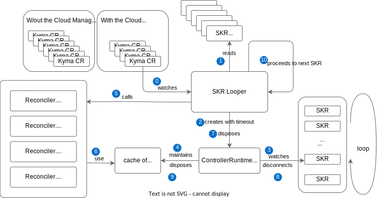

# Cloud Manager Architecture Overview

Cloud Manager is a Kyma module that manages cloud resources from cloud providers in SAP BTP, Kyma runtime virtual private cloud (VPC) network. 

## API and Reconcilers

Cloud Manager defines two API groups:
* `cloud-resources.kyma-project.io` - user-facing API available in SAP BTP, Kyma runtime
* `cloud-control.kyma-project.io` - low-level API in Kyma Control Plane (KCP) projected from the user-facing API in SAP BTP, Kyma runtime

Cloud Manager has a central active component running in KCP that runs two sets of reconciliation loops - one for each API group.

Cloud Resources reconcilers remotely reconcile the `cloud-resources.kyma-project.io` API group from SAP BTP, Kyma runtime, into the low-level `cloud-control.kyma-project.io` API group in KCP. Internally, the reconciliation process is referred to as the **SKR Loop**.

Cloud Control reconcilers locally reconcile the `cloud-control.kyma-project.io` API group into the resources of a cloud provider - hyperscaler. Internally, the reconciliation process is referred to as the **KCP Loop**.

Both sets of reconcilers must also maintain the status of the resources they reconcile. This means that Cloud Control reconcilers observe the status of the Cloud Resources resource group and project it into the status of the Cloud Control resources in KCP. At the same time, Cloud Resources reconcilers observe the status of the Cloud Control resources and project it into the status of the Cloud Control resource group in SKR.

## KCP Cloud Control Controller Manager

The Cloud Control reconcilers are managed by a standard controller-runtime controller manager, which maintains an active long-lived connection to the KCP Kubernetes API. See the Kubernetes [diagram](https://github.com/kubernetes/sample-controller/blob/master/docs/controller-client-go.md) showing how the various components in the client-go library work.

## SKR Cloud Resources Controller Manager

Due to the non-scalable concurrent reconciliation of a large number of clusters, the SKR Cloud Resources Controller Manager cannot maintain long-lived connections on the remote clusters permanently watching for changes. Instead, a custom SKR Looper component loops through SKRs with the Cloud Manager module added, and instantiates new ControllerRuntime manager that lists all the "watched" (reconciler registered with the manager with `.For()` or `.Watches()` methods as defined in controller-runtime) and with them maintain a short-lived "cache" until all SKR reconcilers are called with the respective resources they are managing. Once all is done, all resources for that SKR, short-lived cache, client, etc., are disposed of, and the same process is repeated for the next SKR. 

The reconciler-facing API, like `Reconcile()` and `.SetupWithManager()` functions, remains as close as possible to the one defined by controller-runtime and used by Kubebuilder.

## CloudControl Scope resource

Different cloud providers' APIs require different connection options to define the scope of the operations:
* GCP - project
* Azure - tenant and subscription
* AWS - account

The SKR loop, when projecting into the KCP resources, sets the `kymaName` field as the indication of which SKR the resources refer to. So, the starting point for the KCP Loop reconcilers is the Kyma CR name. Following the path from Kyma CR in KCP to the Shoot CR in Gardener, it is possible to determine the cloud provider scope. 

The Cloud Control KCP resource Scope was introduced to:

* improve performance by not reading so many different resources and reaching out to Gardener
* simplify the development landscape by not avoiding the necessity to be beside the local KCP cluster, and also have the Gardener cluster with all the relevant resources

Upon the appearance of the first resource from a certain SKR, the cloud provider scope is determined, saved in the Scope KCP resource, and the original Cloud Control KCP resource is updated with the `scopeRef`. In dev, scope determination can be avoided by creating a resource that already refers to an existing Scope resource. 

## IpRange

Some cloud resources require the allocation of a private IP, like an NFS instance. Network security is managed differently by different cloud providers. Some cloud providers require firewall-like access approval on the subnet level. To avoid modifying the security configuration created by Gardener, new subnets are allocated instead of provisioning such cloud resources into the node subnets. 

For those purposes, you can use the IpRange resource. In IpRange, you can specify the CIDR used for subnet provisioning. Therefore, the reconciliation of the IpRange results in the creation of the subnets in the cloud provider.

Some cloud providers define a zone attribute on the subnet. This results in as many node subnets as there are zones. 
Some cloud providers don't have the zone on a subnet, but only the region, resulting in only one node's subnet. 
Similarly, as many node subnets there are, as many cloud resources subnets are created. If there's only one subnet, then the entire IpRange CIDR will be used for that one subnet. If there is more than one subnet, then the IpRange CIDR is split into smaller ranges that are allocated to each subnet. 

Any API resource representing a cloud resource that requires a private IP must include a reference to the IpRange resource. 

