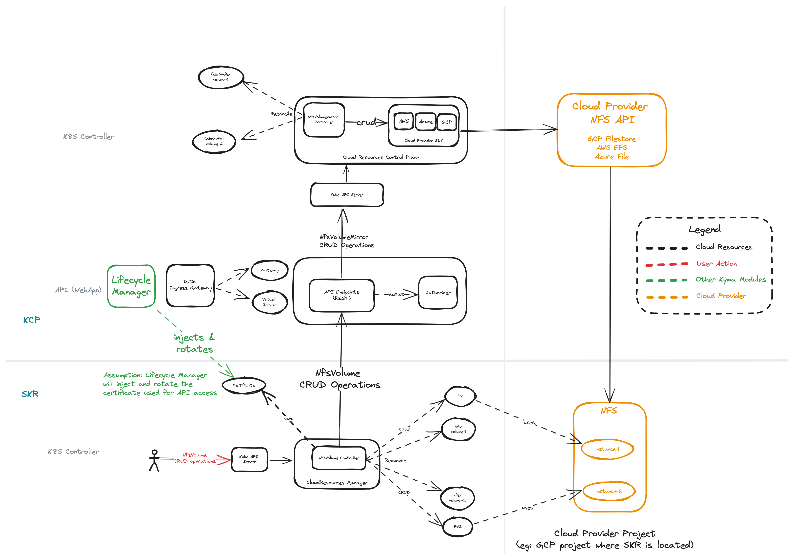

# Cloud Resources Design Approach

Cloud resources module will have the following 3 major components:
- Cloud Resources Manager
    - Kubernetes operator that runs on SKR clusters
    - Will be deployed to SKR when the cluster admin enables `cloud-resources` module.
- Cloud Resources API
    - WebApp provides REST APIs for creating the Cloud Resources.
    - Will be running in KCP.
- Cloud Resources Control Plane
    - Kubernetes operator that runs in KCP cluster.
    - Implements functionlity to work with Cloud Provider(s) and manage the cloud resources.

## NFS Design

### Cloud Resources Manager
Implements:
- `NfsVolume` CR to allow users to provide `desiredState` - NFS related inputs such as `name`, `size`, etc.
- `NfsVolumeController` reconciles NfsVolume CR as follows:
    - Invokes the `Get` API call to get the `currentState`` of this NfsVolume from KCP
    - If the `currentState != desiredState`, then invokes the respective `create, update or delete` API to manage the NFS resource.
    - Creates and manages one `PersistentVolume` for each NfsVolume with the corresponding parameters received from the cloud provider NFS implementation such as `IP address, volume name, etc`

### Cloud Resources API
- Configures `Istio Gateway and Virtual Service` objects to expose a `https` endpoint for REST APIs.
- Leverages `Lifecycle Manager (LM)` to create a self-signed certificate, distribute it to SKR, rotate in periodic intervals.
- Checks the requests and the client certificates to authorize the specific SKR instance to create the cloud resources in their respective projects only.
- Implements a `rate-limiting` and `max-limit` restrictions on the incoming requests based on configuration.

### Cloud Resources Control Plane
Implements: 
- `Module` CR to encapsulate Cloud Provider specific details such as identity information (project-id or account-id), vpc name, subnet name, cloud provider credentials, etc.
- `ResourceSubnet` CR to manage the subnet details for creating cloud resources.
- `NfsShare` CR that mirrors the `NfsVolume` details from SKR and their status.
- `NfsShareController` reconciles NfsShare CR using the respective Cloud Provider SDK.

### NFS Flow

 1. SKR Admin creates or updates or deletes a `NfsVolume` - `desiredState`
 2. Reconcile function is called on the `NfsVolumeController`
 3. Reconciler performs the following:
    - **3a.** Invokes the `Get` API to obtain the `currentState` of this NFS cloud resource.
    - **3b.** Invokes the `Create or Update or Delete` API to syncronize the NfsVolume with the cloud-resource when `(currentState != desiredState)`. 
    - **3c.** Creates or updates or deletes the corresponding`PersistentVolume (PV)` object when `(currentState == desiredState)`.
 4. API server checks the client-certificate and extracts SKR identity to authorize the incoming request by updating SKR details, rate-limiting, checking quota, etc.
 5. API Server translates the incoming request into respective CRUD API for the `NfsShare` and invokes it on the KCP Kube API Server.
 6. Reconcile function is called on the `NfsShareController`
 7. Reconciler performs the following:
    - **7a** Invokes the `Get` API using the Cloud Provider SDK to obtain the `currentState` of this cloud resource 
    - **7b** Invokes the `Create or Update or Delete` API to synchronize the NfsShare with the cloud-resource when `(currentState != desiredState)`
    - **7c** Updates the status of `NfsShare` with the details from **7a** when `(currentState == desiredState)` 
 8. Cloud Provider SDK translates it to the respective CRUD API and manages the cloud-resource.