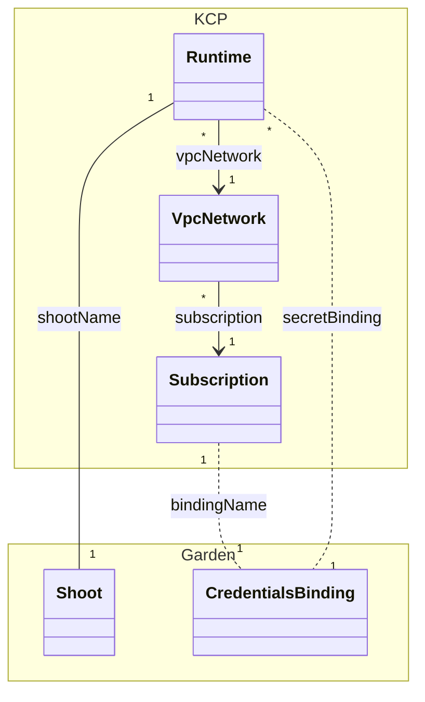
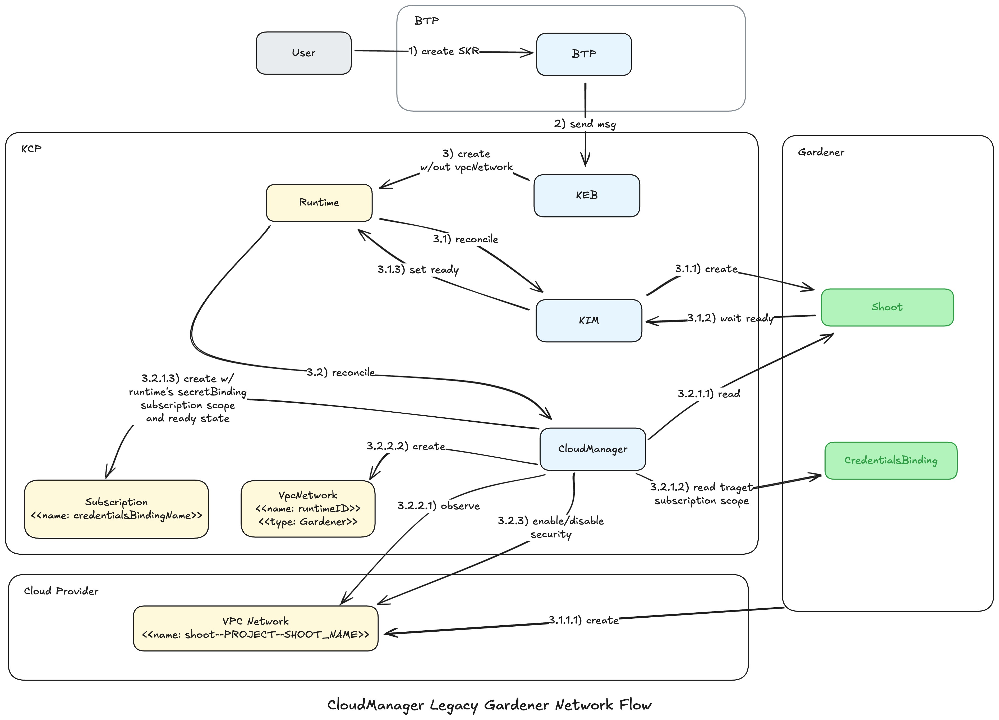
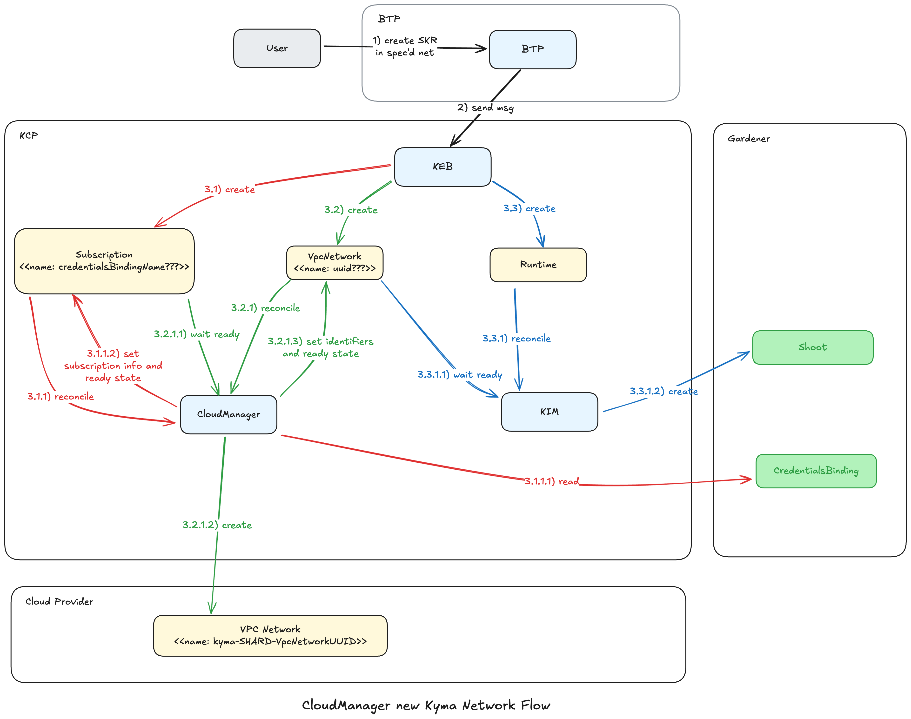

# The Runtime flows

## Landscape overview

* KCP is Kyma control plane Kubernetes cluster
  * Controls many SKR clusters
  * Orchestrates Garden cluster
  * Components:
    * Kyma Environment Broker (KEB) - receives Kyma runtime service broker provisioning requests from BTP and creates Runtime and Kyma resources
    * Kyma Infrastructure Manager (KIM) - reconciles Runtime resource, maintains corresponding Shoot (Garden) and GardenerCluster (KCP)
    * CloudManager - mainly reconciles SKR resources into cloud infrastructure resources, integrates with Runtime and Shoot to determine target cloud subscription
    * Kyma Lifecycle Manager (KLM) - installs Kyma modules in SKR, reconciles Kyma resource that exists both in SKR as KCP
  * Resources:
    * `Runtime` - describes the SKR (provider, region, subscription, nodes, vpc cidrs...), created by KEB, reconciled by KIM, used by CloudManager. Has optional VpcNetwork field that references `VpcNetwork` resource
    * `GardenerCluster` - refers to the SKR admin kubeconfig, exists when `Shoot` is ready, created by KIM, used by CloudManager
    * `Kyma` - contains list of active Kyma modules in the SKR, created by KEB when `Runtime` is ready, synced by KLM with its SKR copy
    * `Scope` - legacy information about the Runtime's subscription and network name and address space, created by CloudManager when cloud-manager module activated, deleted when SKR is deleted
    * `Subscription` - resource representing the cloud provider subscription where Runtimes can run, created by KEB or CloudManager, reconciled by CloudManager by reading `CredentialsBinding` from Garden to determine AWS AccountID, Azure Tenant/Subscription, GCP Project, SAP OpenStack Project
    * `VpcNetwork` - resource representing VPC network desired/observed state, reconciled by CloudManager into/from cloud provider VPC network that hosts Runtimes.
      * Gardener type - legacy mode where Gardener creates VPC network, contains observed network state
      * Kyma type - new mode that creates a VPC network that will be given to Shoot to create K8S cluster in
* SKR is Kyma data plane Kubernetes cluster
* Garden cluster is Gardener control plane used to provision SKR clusters
  * `CredentialsBinding` - match the subscription in the cloud provider
  * `Shoot` - Gardener resource matching one SKR

## Resource Model

* `Runtime`
  * `.spec.shoot.networking.vpcNetwork` - name of the `VpcNetwork` resource
    * if set on creation indicates the new Kyma network flow
    * if not set indicates legacy Gardener network flow, and is set by CloudManager when it creates the `VpcNetwork` resource of type Gardener
  * `.spec.shoot.name` - name of the `Shoot` resource in Garden cluster
  * `.spec.shoot.secretBindingName` - name of the `CredentialsBinding` resource in Garden cluster, used to determine cloud subscription
* `Subscription`
  * `.spec.details.garden.bindingName` - name of the `CredentialsBinding` resource in Garden cluster, used to determine cloud subscription
  * `.status.subscriptionInfo.{aws|azure|gcp|openstack}` - target cloud subscription details (AWS AccountID, Azure Tenant/Subscription, GCP Project, SAP OpenStack Domain/Project)
* `VpcNetwork`
  * `.spec.subscription.name` - name of the `Subscription` resource, used to determine
  * `.spec.vpcNetworkName` - optional, name of the VPC network in the cloud
    * if not set CloudManager uses `kyma-{SHARD_NAME|default}-{VpcNetworkResourceName}|catLen(60)`
  * `.status.identifiers.{vpc|router|internetGateway|resourceGroup}` - created/observed cloud resource identifiers
  * `.status.identifiers.name` - used name, one of
    * value of `.spec.vpcNetworkName` if set
    * `kyma-{SHARD_NAME|default}-{VpcNetworkResourceName}|catLen(60)` if `.spec.vpcNetworkName` not set

## Legacy Gardener Network flow

#### Kyma runtime provisioning 

* **User** creates Kyma runtime in BTP cockpit
* **BTP** sends service broker message to provision Kyma runtime
* **KEB** creates `Runtime` __without vpcNetwork__
* **KIM** creates `Shoot`
* **Gardener** creates VPC network and Kubernetes cluster, then sets `Shoot` ready
* **KIM**
  * creates `GardenerCluster` with admin kubeconfig
  * sets `Runtime` ready
* **KEB**
  * creates `Kyma`

#### CloudManager creates missing Subscription and VpcNetwork type Gardener and handles security

* **CloudManager**
  * handles `Subscription`
    * looks for `Subscription` matching the `Runtime`
      * option 1 - `Subscription` name == `Runtime` secretBinding
      * option 2 - `Subscription` label `cloud-manager.kyma-project.io/binding-name` == `Runtime` secretBinding
    * if `Subscription` not found
      * creates `Subscription` with name = `Runtime`s secretBinding
        * reads `Shoot` and `CredentialsBinding`
        * labels `Subscription` with `cloud-manager.kyma-project.io/binding-name` == spec bindingName
        * sets `Subscription` ready with cloud subscription scope info (AWS account, Azure tenant/subscription, GCP project, SAP OpenStack domain/project) 
  * handles `VpcNetwork`
    * looks for `VpcNetwork` referenced by `Runtime` vpcNetwork field
      * if empty
        * creates `VpcNetwork` type Gardener
          * sets `VpcNetwork` resource name = `Runtime` name
          * sets cloud VPC network name to Gardener format `shoot--{GARDEN_PROJECT}--{SHOOT_NAME}`
          * observes cloud resources (mainly VPC network) created by Gardener
          * sets `VpcNetwork` ready with cloud resource identifiers
        * patches `Runtime` vpcNetwork with `VpcNetwork` name (equals to `Runtime` name)
  * handles subscription/runtime security (PCI-DSS)

#### Activation of cloud-manager module

* **User** adds cloud-manager module to `Kyma` in SKR
* **KLM** syncs SKR `Kyma` to KCP
* **CloudManager**
  * Gets shootName from `Kyma`
  * Reads `Shoot` from Garden
    * Gets region, nodes CIDR 
  * Reads `CredentialsBinding`
    * Gets cloud credentials secret name
  * Reads cloud credentials `Secret`
    * Gets subscription cloud target scope (AWS AccountId, Azure tenant/subscription, GCP Project, SAP OpenStack Domain/Project)
  * Creates `Scope` with 
    * provider
    * region
    * cloud subscription scope
    * nodes CIDR
    * inferred Gardener VPC network name: `shoot--{GARDEN_PROJECT}--{SHOOT_NAME}`

#### Kyma runtime deprovisioning

* **User** deletes Kyma runtime in BTP cockpit
* **BTP** sends service broker message to deprovision Kyma runtime
* **KEB** sets `Kyma` deletionTimestamp
* **KLM** 
  * deletes modules from SKR 
  * removes finalizer from KCP `Kyma`
* KCP `Kyma` is deleted
* **KEB** sets `Runtime` deletionTimestamp
* **KIM** 
  * deletes `Shoot`
  * deletes `GardenerCluster`
* **CloudManager** since `Kyma` is deleted and Scope exists
  * creates `Nuke` resource
    * `Nuke` reconciler deletes all existing user resources (IpRange, Nfs, Redis, Peering...) in the `Scope`
  * deletes `Scope`
* `Runtime` is deleted
* **CloudManager** since Runtime is deleted
  * deletes `VpcNetwork` if type Gardener
  * __DOES NOT DELETE__ `Subscription`

--- 

## New Kyma Network flow

#### Kyma runtime provisioning

* **User** creates Kyma runtime in BTP cockpit
* **BTP** sends service broker message to provision Kyma runtime
* **KEB**
  * handles subscription
    * determines subscription / `CredentialsBinding`
    * looks for `Subscription` with name == `CredentialsBinding` name
    * creates `Subscription` referencing `CredentialsBinding` name, if not found
  * handles VpcNetwork
    * determines VpcNetwork name
      * option 1 - user specified
      * option 2 - use runtime id
    * looks for `VpcNetwork` with determined name
    * creates `VpcNetwork` referencing `Subscription`, if not found
  * creates `Runtime` __with vpcNetwork__ name == `VpcNetwork` name
* **CloudManager**
  * handles `Subscription`
    * if not ready
      * reads `CredentialsBinding` and referred `Secret`
      * determines target cloud subscription scope and writes it to status
      * sets Ready state
    * handles `VpcNetwork`
      * if not ready
        * waits for ready `Subscription`
        * creates VPC network and related resources in the cloud, if they not exist
        * write VPC network name and identifiers to status
        * sets ready Provisioned state
    * handles subscription/runtime security (PCI-DSS)
* **KIM** 
  * finds vpcNetwork is set on `Runtime`
  * waits for `VpcNetwork` to be ready
  * creates `Shoot` with identifiers from the `VpcNetwork` status
* **Gardener** 
  * creates Kubernetes cluster in existing specified network
  * sets `Shoot` ready
* **KIM**
  * creates `GardenerCluster` with admin kubeconfig
  * sets `Runtime` ready
* **KEB**
  * creates `Kyma`

#### Kyma runtime deprovisioning

* **User** deletes Kyma runtime in BTP cockpit
* **BTP** sends service broker message to deprovision Kyma runtime
* **KEB** sets `Kyma` deletionTimestamp
* **KLM**
  * deletes modules from SKR
  * removes finalizer from KCP `Kyma`
* KCP `Kyma` is deleted
* **KEB** sets `Runtime` deletionTimestamp
* **KIM**
  * deletes `Shoot`
  * deletes `GardenerCluster`
* **CloudManager** 
  * Scope not used
  * deletes user resources belonging to the runtime???
    * issue with the lifecycle in case resources are shared between multiple runtimes in the same network
  * **DOES NOT DELETE** `VpcNetwork`
  * **DOES NOT DELETE** `Subscription`
  
#### Network deprovisioning

* **User** deletes network in BTP cockpit (how???)
* **BTP** sends service broker message to deprovision network
* **CloudManager** 
  * verifies no resources exist in the network
  * deletes cloud VPC Network
* `VpcNetwork` is deleted

#### Subscription release

* `Subscription` is free and has to be returned to the pool
  * who??? how???
* `Subscription` gets deletionTimestamp
* **CloudManager** 
  * verifies no resources exist in the subscription
  * removes finalizer
* `Subscription` is deleted
